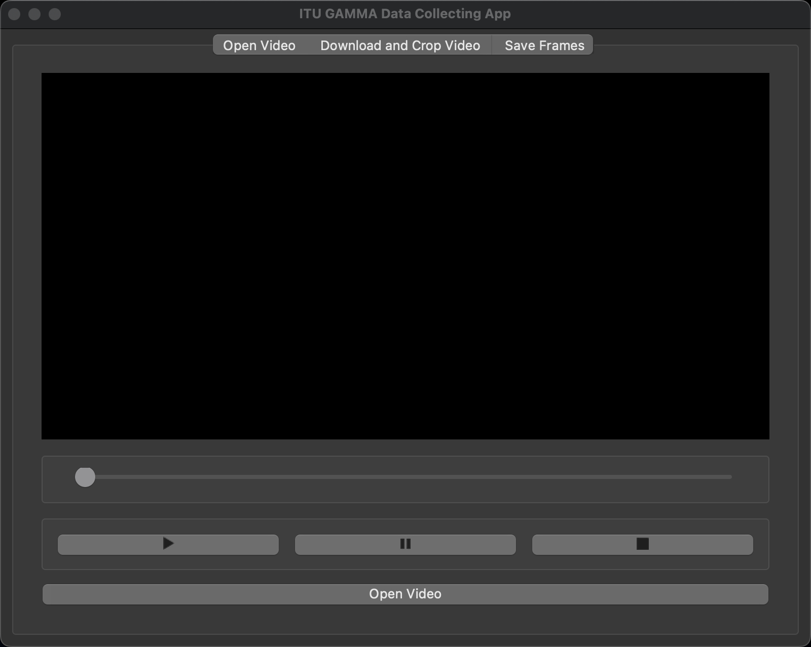
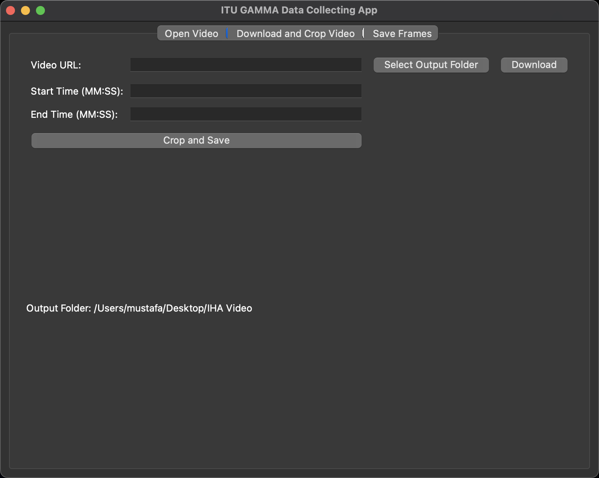
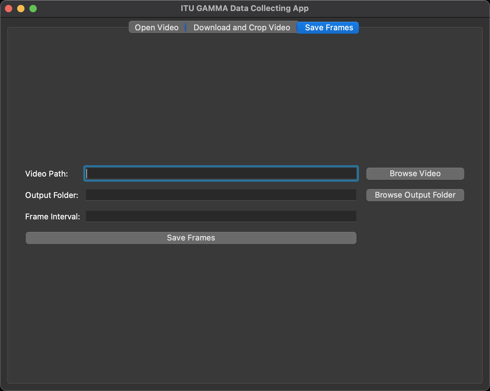

# gamma-data-app

Gamma Data App, PyQt5 ve pytube kütüphanelerini kullanarak basit bir video oynatıcı ve indirme uygulamasıdır. Bu uygulama, takım üyelerinin video URL'lerini yapıştırarak veya yerel videoları açarak video izlemelerine ve indirmelerine olanak tanır. Bu sayede veriseti oluşturma işinin kolaylaştırılması hedeflenmektedir.

## Özellikler

- Video oynatma, duraklatma ve durdurma
- Videoyu belirli bir zaman aralığında kırpma ve kaydetme
- YouTube üzerinden video indirme ve yerel sürücüye kaydetme
- Videodan karelerin belirli bir aralıkla kaydedilmesi

## Kurulum

1. Bu repoyu klonlayın veya indirin:

```bash
git clone https://github.com/mozgor19/gamma-data-app.git
```

2. Gerekli Python kütüphanelerini yükleyin:

```bash
pip install PyQt5 pytube
```

3. Uygulamayı çalıştırın:

```bash
python gammaApp.py
```

## Kullanım

- **Video Açma**: "Open Video" butonuna tıklayarak yerel bir videoyu açın veya "Download and Crop Video" sekmesinden bir YouTube videosu indirin ve oynatın.
- **Video İzleme**: Oynatma, duraklatma ve durdurma düğmelerini kullanarak videoyu kontrol edin. Ayrıca klavyenizdeki "Space" tuşuna basarak oynatma/duraklatma yapabilirsiniz.
- **Video Kırpma ve Kaydetme**: "Download and Crop Video" sekmesinde, indirilen veya açılan bir videoyu belirli bir zaman aralığında kırparak kaydedebilirsiniz.
- **Video Karelerini Kaydetme**: "Save Frames" sekmesinde, videoyu belirli bir aralıkla ilerleterek ve her bir kareyi kaydederek video karelerini çıkarabilirsiniz.

## Ekran Görüntüleri






